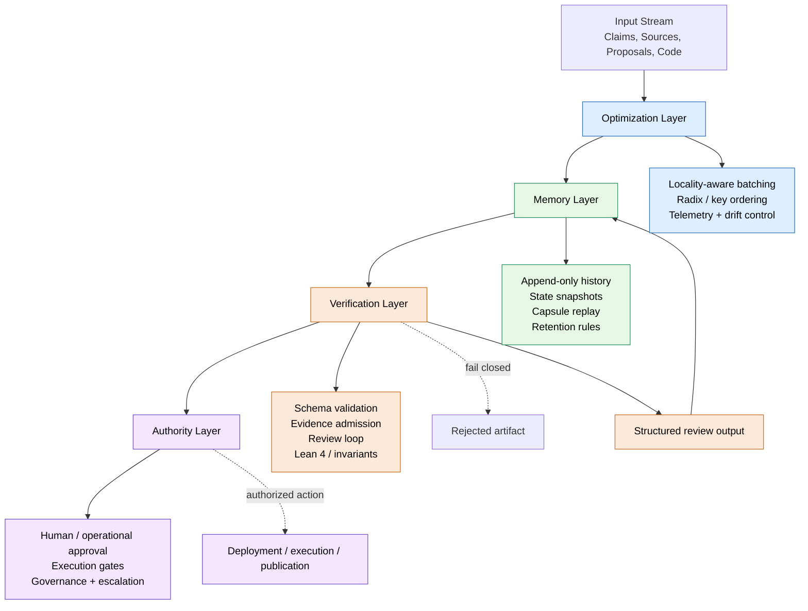

# Grounded Architecture Stack for Verifiable Agentic Research

## Purpose

This document defines a realistic architecture for an AI research and validation system that can be built, tested, and governed without inflating speculative claims about machine truth, sovereign execution, or mystical optimization. The objective is not to create a universal intelligence substrate. The objective is to build a system that is explicit about scope, reviewable under evidence rules, constrained by authority boundaries, and efficient enough to operate in real environments.

The architecture is organized into four layers:

1. Optimization layer
2. Memory layer
3. Verification layer
4. Authority layer

Each layer has a distinct responsibility. No lower layer is permitted to grant authority by implication.

---

## 1. Layered Architecture Overview

### 1.1 Optimization Layer

The optimization layer exists to reduce computational overhead and improve locality when handling large volumes of research work, proposals, evidence, or review rounds.

Its goals are practical and measurable:
- decrease cache churn during repeated structured processing;
- batch related tasks into clustered evaluation windows;
- sort or order work in a way that improves throughput;
- reduce wasted scheduling cycles during high burst activity.

This layer may use locality-sensitive ordering, fixed-width key generation, stable batched sorting, and telemetry-driven throttling. Techniques such as radix sorting or Hilbert-style key ordering are valid here if they are treated as performance heuristics, not as sources of truth.

Key principle:
- optimization improves execution efficiency, not epistemic confidence.

What this layer must not do:
- declare a claim true;
- certify evidence as valid;
- grant execution rights;
- replace review or human authorization.

### 1.2 Memory Layer

The memory layer is responsible for continuity of state across time. It is the system's durable record of prior decisions, context windows, proposals, review history, and transitions.

This layer allows the system to carry forward relevant memory without relying on a single giant prompt or a fragile live-session context. It should support append-only logs, capsule-like state snapshots, reconstruction of prior state, and explicit retention rules.

This is a practical version of memory continuity: a structured ledger of state changes that can be replayed, inspected, and revalidated. It is not the same as claiming that the machine has a sovereign identity or an unbounded internal continuity of self.

Key principle:
- memory should be explicit, replayable, bounded, and exportable.

What this layer must not do:
- replace provenance with a narrative memory;
- hide uncertainty or stale context;
- silently escalate by reusing previous states without revalidation.

### 1.3 Verification Layer

The verification layer is where the system decides whether a proposal, artifact, or proof is coherent, structurally valid, and formally consistent with its declared rules.

This layer includes:
- schema validation;
- evidence admission checks;
- provenance and freshness checks;
- adversarial review;
- deterministic test execution;
- symbolic or formal verification where applicable;
- invariant enforcement and fail-closed behavior.

This is the strongest and most grounded layer in the stack. Formal verification is useful here, especially when the task is narrow, explicit, and mathematically well-specified. Lean 4 is relevant because it can check formal rules and invariants, but it is not a substitute for evidence quality, operational safety, or human authority.

Key principle:
- verification is about consistency, not certainty about the world.

What this layer must not do:
- prove that the source data is true;
- prove that a strategy is profitable;
- prove that a model is trustworthy in the real world;
- authorize deployment or action by implication.

### 1.4 Authority Layer

The authority layer is the human or operational boundary that makes the final decision to act. It owns execution permissions, deployment decisions, access controls, and governance escalations.

This is where operational control lives. The system may validate, review, and present evidence, but it does not automatically decide to run a financial strategy, execute code, publish a claim, or open a system action path.

Key principle:
- only a separate authority can authorize action.

What this layer must not do:
- infer authority from a successful review;
- treat a proof as permission;
- skip escalation when risk is material.

---

## 2. Fundamental Principles

### 2.1 Separate Proposing from Judging

An agent or model may propose a claim, code patch, proof script, or research artifact. It must not be the sole judge of its own proposal. Review must be structurally independent and auditable.

This principle is essential for avoiding sycophancy, self-reinforcing error loops, and the false comfort of a model approving its own output.

Implementation practice:
- proposal generation is distinct from review;
- review findings are structured and evidence-linked;
- revisions are bounded and non-progress is rejected;
- unresolved findings stop acceptance.

### 2.2 Evidence Is Not Truth

A valid evidence record proves that the record has the required shape and provenance metadata. It does not establish that the underlying claim is true.

This distinction is one of the most important realities in the entire architecture. A piece of evidence may be well-formed, fresh, and provenance-backed and still be wrong, incomplete, or irrelevant.

Implementation practice:
- validate format and provenance separately from truth claims;
- admit evidence under explicit freshness and source constraints;
- track the exact basis of each claim.

### 2.3 Deterministic Failure Is Authoritative

When a schema check, review finding, invariant, proof obligation, or test fails, the system must fail closed. Natural-language explanation should not reclassify failure into success.

This creates a stable protocol. It avoids the pattern where a system “explains away” a failed validation or reinterprets a broken check as acceptable.

Implementation practice:
- rejection is structurally encoded;
- invalid revisions fail immediately;
- timeouts and unresolved issues stop the loop;
- a failed proof remains a failed proof.

### 2.4 Narrow Invariants Are Better Than Grand Claims

Formal tools work best on tightly scoped invariants such as:
- state transitions,
- schema conformance,
- permission checks,
- updates to validity states,
- serialization and protocol correctness,
- straightforward proof obligations.

They are much weaker at proving broad claims about external reality, social systems, markets, or long-term human outcomes.

Implementation practice:
- verify focused rules first;
- separate formal correctness from empirical evidence;
- attach limitations to any broad claim.

### 2.5 No Authority by Implication

A research artifact must never implicitly grant execution authority. It may describe a proposal, a claim, or a proof, but it cannot silently turn into software execution, identity ownership, trading permission, deployment approval, or operational action.

This is a crucial design constraint. It prevents the system from confusing an artifact with authorization.

Implementation practice:
- explicit execution_authorized flags;
- explicit promotion records;
- separate human decision point;
- no hidden action grants.

### 2.6 Reproducibility Before Optimization

Performance gains only matter if the system remains deterministic, consistent, and defensible.

This means:
- fixed fixtures,
- versioned tools,
- testability,
- clear baselines,
- no silent weakening of validation in the name of speed.

Implementation practice:
- audit performance changes against a known baseline;
- keep structural checks in place even when batching or optimization is enabled;
- verify that optimization does not remove required safeguards.

---

## 3. The Realistic Transformation Path

The “ultimate transformation” is not a single leap to a universal AI reality. It is a disciplined progression through four stages.

### Stage 1: Contract and Review Foundation

The starting point is a protocol that makes artifacts explicit, reviewable, and bounded.

Required elements:
- schema versioning;
- producer and timestamp metadata;
- content hashes and lineage;
- evidence references;
- review and response records;
- explicit non-authority status.

This gives the system an accountable artifact layer instead of a free-form conversational output layer.

### Stage 2: Adversarial and Deterministic Review Layer

Once the artifact is structured, the system must challenge it under controlled conditions.

Required elements:
- independent review functions;
- bounded revision loops;
- evidence-based rebuttals;
- repeated non-progress detection;
- fail-closed rejection when a reviewer output is malformed.

This ensures the system learns to defend itself against flawed proposals rather than silently accepting them.

### Stage 3: Locality-Aware Execution and Memory Continuity

The system then becomes more efficient and more stable by adding ordering and memory mechanisms.

Required elements:
- clustering of related tasks;
- locality-aware keying or batching strategies;
- correction for drift in input distribution;
- append-only memory records;
- reconstruction of state across restarts or context resets.

This reduces overhead while preserving continuity without pretending the machine has become an autonomous authority.

### Stage 4: Formal Verification + Authority Separation

The final stage is to add formal checks where they are truly valuable and keep authority outside the model loop.

Required elements:
- Lean 4 or similar proof verification for narrow invariants;
- deterministic fail-stop behavior;
- policy-driven human approval;
- explicit deployment boundaries.

This creates a system where formal correctness and human control are separated and intentional rather than conflated.

---

## 4. Practical Guidance for Layer Design

### 4.1 Optimization Layer Design Rules

- Batch by similarity or dependency when possible.
- Use stable ordering to reduce memory churn and improve local reuse.
- Track burstiness and cluster drift using telemetry.
- Never rely on ordering alone to infer correctness.

### 4.2 Memory Layer Design Rules

- Treat memory as a ledger, not a magical state of mind.
- Make each capsule or state record re-readable and auditable.
- Keep memory bounded and explicit.
- Revalidate stale memory before reuse.

### 4.3 Verification Layer Design Rules

- Validate structure separately from validity claims.
- Keep checks deterministic and reproducible.
- Use narrow proof obligations rather than broad metaphysical claims.
- Fail closed when the verification pipeline cannot establish trust.

### 4.4 Authority Layer Design Rules

- Human or operational approval remains the real decision boundary.
- No artifact should carry action authority implicitly.
- All escalation paths should be explicit and reviewable.
- Every action should be traceable to a policy or explicit approval record.

---

## 5. One-Page Architecture Diagram

---

## 6. Concise Protocol Paragraph for the Draft

The Atmanatic architecture is organized into four governance layers: an optimization layer for locality-aware batching and efficient execution, a memory layer for durable and replayable state continuity, a verification layer for schema, evidence, review, and formal invariant checking, and an authority layer for human or operational approval before any action is authorized. These layers are intentionally separated: optimization improves throughput, memory preserves continuity, verification enforces deterministic validity conditions, and authority decides whether an artifact may be acted upon. No lower layer grants execution authority by implication. A proposal remains non-authorizing unless it is explicitly accepted through the authority boundary, and every transition is bound to reviewable provenance, reproducible validation, and fail-closed rejection when required invariants are unmet.

---

## 7. Final Reality Check

This architecture is grounded because it keeps the following distinctions explicit:

- performance is not truth;
- memory is not authority;
- verification is not action;
- systems may be efficient, localized, and formally checked without becoming self-authorizing or externally omniscient.

The transformation is not from “AI becomes truth.” The transformation is from “AI output becomes a governable, reviewable, deterministic artifact layer.” That is both more realistic and more useful.
